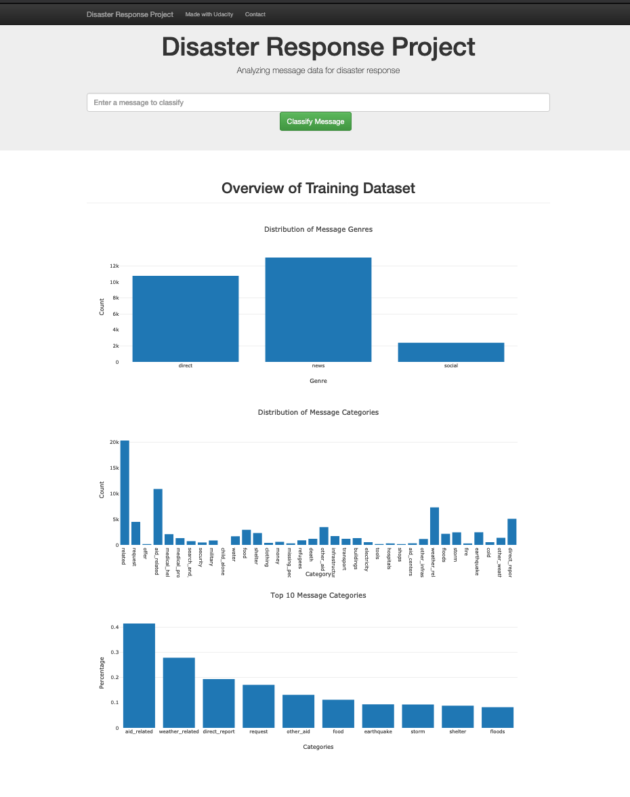

# Disaster Response Pipeline Project

### Instructions:
1. Run the following commands in the project's root directory to set up your database and model.

    - To run ETL pipeline that cleans data and stores in database
        `python data/process_data.py data/disaster_messages.csv data/disaster_categories.csv data/DisasterResponse.db`
    - To run ML pipeline that trains classifier and saves
        `python models/train_classifier.py data/DisasterResponse.db models/classifier.pkl`

2. Run the following command in the app's directory to run your web app.
    `python run.py`

3. Go to http://0.0.0.0:3001/

### ETL internals
The ETL process takes text as an input and processes the input text into words and then removes most common stopwords using the `nltk` stopwords dictionary

### ML internals
ML classifier script uses`Adaboost` a boosted tree algorithm as a classifier and run a grid search with 3 iteration of cross validation

### App Screenshot

